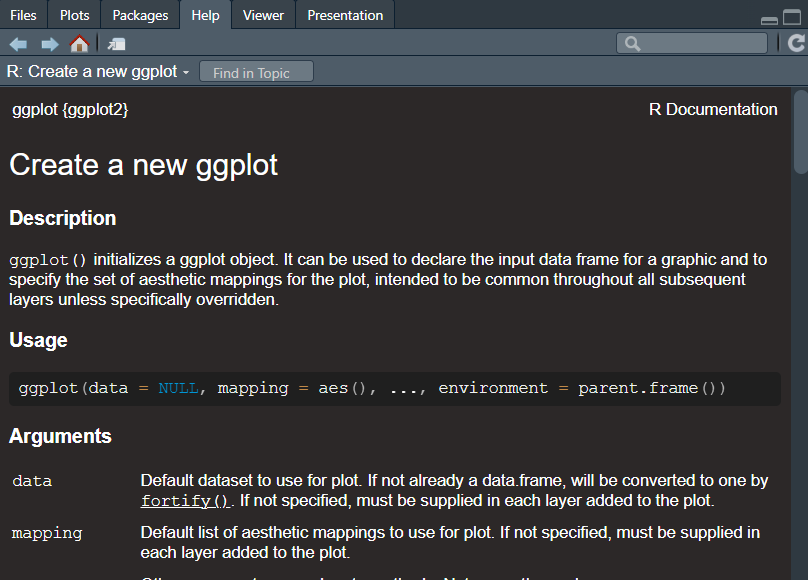

:::::::::::::::::::::::::::::::::::::: questions

- What does well-documented code look like?

::::::::::::::::::::::::::::::::::::::::::::::::

::::::::::::::::::::::::::::::::::::: objectives

- Be introduced to good software documentation practices

::::::::::::::::::::::::::::::::::::::::::::::::

## Code examples

In this episode we'll review some examples of research software and evaluate how readable and reusable it is.
The examples are deliberately small and illustrative: the same documentation principles apply to any research
code, whether you're working with text and corpora, qualitative coding, survey data, clinical records, or
quantitative measurements.

### Example of no documentation

Here is some code intended to process a piece of text. What does this code do? It's not clear what the code
is for or why it was written.

::: group-tab

### Python

This is some research code that is contained in a Python function.

```python
def run(x):
  weird_num = 0.85
  return len(x.split(sep)) * weird_num - skipped
```

### R

This is some research code that is contained in an R function.

```R
run <- function(x) {
  weird_num = 0.85
  return length(strsplit(x, sep)[[1]]) * weird_num - skipped
}
```

:::

:::: challenge

Read and evaluate this code.

- What is the purpose of this function?
- What do the variables mean?
- Would you rely on this code in your research? Why, or why not?

::::

The function name doesn't explain what the code does, and there are no comments or notes to clarify the author's
intent. The variable names don't help either: what does `x` represent? Where would we look to find out more about
`weird_num`? It's effectively a "magic" number, stated arbitrarily and left unexplained. The logic of the
expression is equally cryptic.

In fact a closer read shows the code can't even run as written: `sep` and `skipped` are referenced but never
defined. Without documentation, mistakes like that are easy to overlook until something breaks.

### Well-documented example

Now let's look at an example of best practices in documenting research software. (These snippets come from the end
product of this course, so don't worry if they don't make sense yet.)

::: group-tab

### Python

This is a Python function that processes a piece of text. The specifics of the calculation aren't important
here&mdash;what matters is that the code carries plenty of documentation to help us read and understand it.
The same conventions apply whether the function counts words, codes interview responses, summarises survey
data, or computes statistics.

```python
def count_words(text: str) -> int:
    """
    Counts the number of words in a piece of text.

    Words are taken to be sequences of characters separated by
    whitespace, which is a useful first approximation for tasks
    such as document summarisation, readability checks, or corpus
    analysis.

    Args:
        text (str): The text to count words in.

    Returns:
        int: The number of words in the text.

    Examples:
        >>> count_words("the quick brown fox")
        4
        >>> count_words("hello   world")
        2
    """
    # Split on any run of whitespace; empty tokens are discarded
    words = text.split()

    return len(words)
```

### R

Here is the same task written in R. Again, the specifics of the calculation are incidental; the point is the
documentation that surrounds the code. R uses the [roxygen2][roxygen2] package to format documentation strings
into our project documentation.

```R
#' Count the words in a piece of text
#'
#' @description
#' Counts the number of words in a piece of text. Words are taken
#' to be sequences of characters separated by whitespace, which is
#' a useful first approximation for tasks such as document
#' summarisation, readability checks, or corpus analysis.
#'
#' @param text The text to count words in.
#'
#' @returns The number of words in the text.
#'
#' @examples
#' count_words("the quick brown fox")
#' count_words("hello   world")
count_words <- function(text) {
  # Split on any run of whitespace; empty tokens are discarded
  words <- strsplit(text, "\\s+")[[1]]
  words <- words[words != ""]

  return(length(words))
}
```

:::

:::: discussion

Read and evaluate this code.

- Can you tell what the purpose of the function is?
- What is the meaning of the variables?
- Which code would you prefer to use?

::::

This time, the function name is a verb that describes what the code does. A clear description spells out the
purpose for the reader, and comment lines (starting with `#`) explain how the calculation works. Each variable
has a descriptive, human-readable name, and built-in language features handle the splitting of the text, so a
reader can look up `split()` or `strsplit()` elsewhere rather than puzzling over a bespoke implementation.

The result is code that is much **easier to interpret**, maintain, and modify in the future.

Some of the syntax in this example may be unfamiliar&mdash;that's fine. We'll cover the basics as the course
progresses.

## Real-world examples

Let's review real-world examples of the documentation for software packages that are used in research. The two
examples below come from the quantitative-sciences mainstream, but the same documentation patterns turn up in
tools used right across the disciplines&mdash;for example text-analysis libraries such as [spaCy][spacy] or
[quanteda][quanteda], and many qualitative-data and digital-humanities packages.

### NumPy user guide

NumPy is a mathematical package for Python, widely used for quantitative computing and linear algebra. The
[NumPy User Guide](https://numpy.org/doc/2.0/user/index.html#user) is a **thorough website**, organised into sections
that cover different aspects of the package.

It includes a beginner's guide, tutorials for common use cases, and in-depth write-ups of specific technical details.
Some content assumes no prior knowledge; other parts serve as a reference for readers with a background in mathematics
or programming.

If we want to read more about how to use a certain feature, there are documentation pages such as
[numpy.array](https://numpy.org/doc/stable/reference/generated/numpy.array.html) that describe purpose and the
parameters of each function. If we're in a Python interpreter shell, we can use the [`help()` in-built
function](https://docs.python.org/3/library/functions.html#help) to view the documentation:

```python
import numpy
help(numpy.array)
```

```python
Help on built-in function array in module numpy:

array(...)
    array(object, dtype=None, *, copy=True, order='K', subok=False, ndmin=0,
          like=None)

    Create an array.

    Parameters
    ----------
    object : array_like
        An array, any object exposing the array interface, an object whose
        ``__array__`` method returns an array, or any (nested) sequence.
        If object is a scalar, a 0-dimensional array containing object is
        returned.
...
```

### ggplot2 documentation site

[ggplot2](https://cloud.r-project.org/web/packages/ggplot2/) is a package for the R statistical language that produces
data visualisations and graphics. The [ggplot2 documentation](https://ggplot2.tidyverse.org/index.html) has a simple,
accessible layout that **walks a new user through** installing the package and getting up and running. It also
provides a "cheat sheet": a reference guide that lists commonly used commands in an attractive two-page layout. The
documentation is moderate in scope and links out to further resources, such as online courses hosted elsewhere.

In R, we can view the documentation for each function by using the `?` syntax. For example, calling `?ggplot2::ggplot`
will show the help text for that function or load the reference information in a web browser. Also, if we ever needed to
read it, the source code is neatly organised into [R code files](https://github.com/tidyverse/ggplot2/tree/main/R) in
the repository. For example, the function [ggplot()](https://github.com/tidyverse/ggplot2/blob/main/R/plot.R) includes
an extensive description of the purpose and operation of that code, including a list of the parameters and examples of
how to use it.

```R
install.packages("ggplot2")
library(ggplot2)
?ggplot2::ggplot
```

{alt='A screenshot of the user guide for the
ggplot2 ggplot function in RStudio.'}

[roxygen2]: https://roxygen2.r-lib.org/index.html
[spacy]: https://spacy.io/
[quanteda]: https://quanteda.io/
