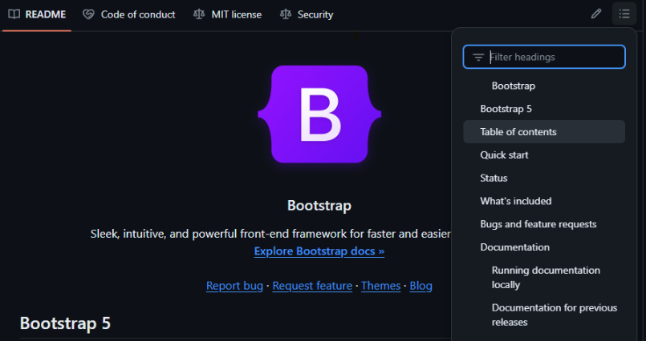

:::::::::::::::::::::::::::::::::::::: questions 

- What is a README file?
- How do I write a README for my research code?
- What are the contents of a good README file?

::::::::::::::::::::::::::::::::::::::::::::::::

::::::::::::::::::::::::::::::::::::: objectives

- Explain why and how to write a README file for research software
- Learn how to structure a README file into sections
- Understand the important components of a good README

::::::::::::::::::::::::::::::::::::::::::::::::

## What is a README file?

A README file is the first thing a user sees when they find your software. It should give them an approachable overview of the package, define what’s possible to achieve with this code, and get them started on the right track to use the software effectively for their research.

A README contains a brief introduction to the code and shows them how to get started using it. For larger packages, the README forms a concise beginner guide and might link to a more detailed user guide that is located elsewhere.

The **audience** for a README file is the end user. It's important to consider _the person_ will read your documentation, and to see things from their point of view. It may be someone who is unfamiliar with certain technical terms, or a researcher will less experience of advanced computing. A good approach is to imagine writing a manual for a new user who has never seen this software before.

## How to write a README

To start writing a README file, the simplest way is to just create an empty text file called `README.txt` and start writing. This file should be located in the directory (or folder) that contains your software project. 

::::::::::::::::::::::::::::::::: challenge

Let's create a new code project. Create a new, empty directory to contain your work. Then, start writing your README!

::::::::::::::::: solution

Follow these general steps to create a README file.
The specific details for each operating system are detailed below.

1. Create a directory to contain your project. We call this the _root directory_;
2. In that directory, create a new text file;
3. Name the file `README.txt`;
4. Open the file for editing&mdash;start writing your documentation!

::: group-tab

### Windows

1. Open [File Explorer](https://support.microsoft.com/en-gb/windows/find-and-open-file-explorer-ef370130-1cca-9dc5-e0df-2f7416fe1cb1) to browse the file system;
2. In a folder, right click and select New &rightarrow; Folder;
3. Name the folder `oddsong`;
4. Open that new folder, then right click and select New &rightarrow; Text Document;
5. Name the file `README.txt`;
6. Double-click on the file to open it for editing.

### Linux

Use the [File Manager](https://help.ubuntu.com/stable/ubuntu-help/files-browse.html.en) to create a new directory called `oddsong`. Inside that folder, create a new text file called `README.txt`.

These steps may be achieved using the terminal as follows:

```bash
mkdir oddsong
touch oddsong/README.txt
echo "This is my code" >> my_project/oddsong.txt
nano oddsong/README.txt
```

### MacOS

Use the [Finder](https://support.apple.com/en-gb/guide/mac-help/mchlp2605/mac) file manager to create a new directory called `oddsong`. Inside that folder, create a new text file called `README.txt`.

These steps may be achieved using the terminal as follows:

```bash
mkdir oddsong
touch oddsong/README.txt
echo "This is my code" >> my_project/oddsong.txt
nano oddsong/README.txt
```

:::

::::::::::::::::::::::::::

:::::::::::::::::::::::::::::::::::::::::::

The essentials contents of a README file are:

- The name of the software. This seems trivial, but a clear title and description of a piece of software will be essential for others to identify your software and differentiate it from others.
- A brief introduction to your code, including links to relevant websites or contact details for the maintainers. - It should be clear who the target audience is for the software package.
- Installation instructions or a link to further information published elsewhere.
- Usage instructions, ideally including a “quick start” guide with a few simple examples to get people up and running with your software package.

It can be useful to signpost to other, related useful software tools by providing links and explaining how other software is related or different to this project when it comes to addressing these kinds of research problems.

::: callout

Put yourself in the shoes of a researcher who has encountered your software for the first time.
Consider, if you had to start from square one, how would you like the code to be introduced to you?
Remember: things that are obvious to you and your colleagues may not be clear to others.
What assumed knowledge must you explicitly explain to get them up to speed?

:::

For research code, it’s often important to explain the context in which the software was written and the theory behind it. For example, many researchers write analysis packages or workflows that are based on previously-published research, statistical methods, or theoretical models for which citations can be provided. By including references to research papers we better help the users to understand the methods that are implemented by our software, which enables its users to properly cite their sources and increases the users’ confidence that you have applied those methods correctly.

### Installation instructions

Provide instructions for installing your research software. These steps should be laid out in simple, clear language and organised in a step-by-step manner.

::: challenge

Consider a research code project you've worked on.
Discuss the technical prerequisites for that software or system.
What would someone need to do, when starting from a blank slate, to recreate that environment?

Think about:

- What hardware and software did you need?
- What drivers and libraries were required?
- What software setup, calibration, and configuration is required?

:::

For most research code, the user will need to install the programming language onto their computer, such as R or Python, so it’s useful to link to the download pages and provide a link to the package manager tools that are commonly used in those ecosystems. This might also include listing any prerequisites such as hardware or software that must be installed first, such as device drivers. 

Consider how the installation method might differ for users of other common operating systems, such as Windows, Linux, and Mac OS.

### User guide

All software should include some short guidance on how to use it and what the main options and features are. This might be a “quick start” guide with simple examples of common use-cases, or a walkthrough that uses a sample data set. Explain how the software can be configured or customised, including examples of commonly-used options. If the software integrates with other tools or uses specific file formats for its input and output, it’s useful to explain this here too. It’s a good idea to include links to further documentation if available.

Many users will benefit from a frequently asked questions (FAQ) or troubleshooting notes, which describes common error messages, explains why they occur, and the steps to resolve them.

The writing style should be concise, jargon-free, clear, and pitched at the appropriate level to the intended target audience. All technical terms and acronyms should be explained. However, don’t reinvent the wheel by defining all the terms used, instead link to a reliable external source or journal article.

Diagrams can be particularly useful to explain complex concepts and workflows. Screenshots may also provide a visual demonstration of how the software will work.

## Markdown format

Most people prefer to use a file format that allows you to create headers to organise the content into sections or chapters, which is much clearer for the reader.

In this case, a Markdown document may be used. Markdown is a simple mark-up language that allows you to format your text using symbols to represent headers, bold text, bullet lists, etc. that are displayed to the user in an appealing way. The Markdown syntax will be converted into appealing visual styles that make your documentation more aesthetically pleasing and easier to read.

::::::::::::::::::::::::::::::::: challenge

Convert your README file to Markdown format to enable more advanced formatting options.

::::::::::::::::: solution

Follow these steps to rename `README.txt` to `README.md`.

::: group-tab

### Windows

Use [File Explorer](https://support.microsoft.com/en-gb/windows/find-and-open-file-explorer-ef370130-1cca-9dc5-e0df-2f7416fe1cb1) to [rename the file](https://support.microsoft.com/en-gb/office/rename-a-file-baea7aab-760b-4ee0-af58-06e940d505a4) from `README.txt` to `README.md`.

1. Open the `oddsong` directory;
2. Right-click on `README.txt` and select "Rename";
3. Type `README.md`.

### Linux

Use the [File Manager](https://help.ubuntu.com/stable/ubuntu-help/files-browse.html.en) to [rename the file](https://help.ubuntu.com/stable/ubuntu-help/files-rename.html.en) from `README.txt` to `README.md`.

This step may be achieved using the terminal as follows:

```bash
mv README.txt README.md
```

### MacOS

Use the [Finder](https://support.apple.com/en-gb/guide/mac-help/mchlp2605/mac) to [rename the file](https://support.apple.com/en-gb/guide/mac-help/mchlp1144/mac) from `README.txt` to `README.md`.

This step may be achieved using the terminal as follows:

```bash
mv README.txt README.md
```

:::

::::::::::::::::::::::::::

:::::::::::::::::::::::::::::::::::::::::::

An example README file in Markdown format is shown below, in a file called `README.md` where .md is the file extension for Markdown files.

### Section headers

You can separate your document into hierarchical sections with headings using the `#` symbol. This makes your README easier to navigate. For example:

```markdown
# My research software

This software is designed to...

# Installation

To install this software...

# Usage

To use this package...
```

The “#” symbol means that line will be converted into a header and displayed to the reader in a large, bold font. This makes it easier for the reader to find the part of your text they're looking for, just like having chapters in a book.

If your code is published on GitHub, the home page of your code repository will display the README.md file, including a navigation menu that is automatically created to easily select the section of the document to view.

{alt="A screenshot of a GitHub repository with a drop-down navigation menu on the readme text box."}

### Text formatting

Here are some commonly-used text formatting options that can be used with Markdown syntax:

| Text display      | Syntax              |
| ----------------- | ------------------- |
| **Bold font**     | `**Bold font**`     |
| *Italic text*     | `*Italic text*`     |
| <u>Underlined</u> | `<u>Underlined</u>` |
| `Code block`      | ``` `code block` ``` |
| [Hyperlink](https://sheffield.ac.uk) | `[Hyperlink](https://sheffield.ac.uk)` |

### Block quotes

We can create a citation with appealing formatting by using the blockquote syntax in Markdown, which is similar to the method used in email.

```markdown
> This text is part of a blockquote.
```

This will be rendered with the following apperearance:

> This text is part of a blockquote.

### Code blocks

If you'd like to present the user will examples of source code, use code fences to display the code in a special text box with syntax highlighting. For example:

<code>
```
pi = 3.14
```
</code>

::: callout

You can learn more about writing documents using Markdown at [Markdown Guide](https://www.markdownguide.org/), a reference for using this syntax.

:::

Remember, the README file is a first impression that research users will receive for your software. Make them informative and user-friendly to enhance the research experience for others and foster collaboration.

:::::: keypoints

 - A README file serves as an introduction to your software, guiding users on installation, usage, and understanding its capabilities.
 - Consider the user's technical background; write clearly and avoid jargon.
 - A README contains a brief description of the software, installation instructions, and a usage guide.
 - The writing style should be concide, clear, and explain technical terms.
 - Use diagrams and screenshots for clarity.
 - Markdown is a recommended format for creating headers, bold text, bullet points, etc.

::::::
