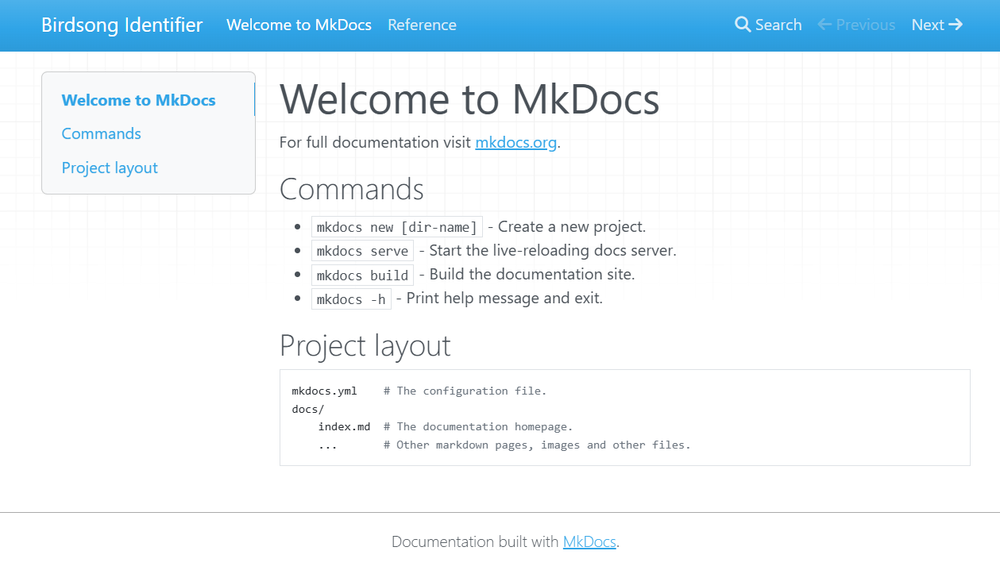
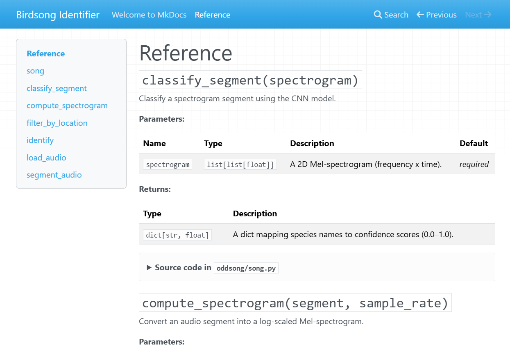

:::::::::::::::::::::::::::::::::::::: questions

- How do I present **comprehensive information** to users of my research software?
- How do I generate a website containing a user guide to my code?
- What should a good documentation website contain?
- How do I publish my software documentation on the internet?

::::::::::::::::::::::::::::::::::::::::::::::::

::::::::::::::::::::::::::::::::::::: objectives

- Learn about **documentation websites** for software packages.
- Gain basic familiarity with some common website generation tools.
- Understand the basics of structuring a documentation website.
- Be able to set up a static site deployment workflow.

::::::::::::::::::::::::::::::::::::::::::::::::

## Documentation websites

A documentation website is a user guide and reference manual for a library of research code. Up to now, we've looked at
ways to put helpful notes in our code, but now we'll learn how to write a longer, more complete guide to the research
tools you create.

A documentation site brings all your user guidance into one place. This kind of resource may be prepared for research
software and will usually contain an introduction, installation instructions, a user guide, troubleshooting tips, and an
in-depth reference section.

To get an idea of this, here are some links documentation websites for widely-used data analysis and research software
packages:

- [pandas](https://pandas.pydata.org/docs/) is a data processing library for the Python programming language.
- [ggplot2](https://ggplot2.tidyverse.org/index.html) is a plotting package for the R statistical language.
- [scikit-learn](https://scikit-learn.org/stable/user_guide.html) is a machine learning library for the Python
  programming language.

::::::::::::::::::::::::::::::::::::: discussion

Evaluate these documentation sites.

- What do you like about them?
- How approachable are they as a new user?
- What do you find difficult to understand in this material?

:::::::::::::::::::::::::::::::::::::

Keep these impressions in mind as we explore what makes a good documentation site and how to build one.

## Why create a website?

There are many advantages to building a documentation site to provide a information-rich resource for researchers who
use your code at institutions all around the world.

### Advantages

These sites can work as **hubs for collaboration**, sharing the latest updates, and encouraging people to take up your
system and get involved in improving it. The effort of setting one up will be rewarded in the long run because you will
have created a valuable asset that will foster collaboration and knowledge sharing in your research community.

A key foundation stone of modern digital research practices is the ability to **replicate results** by reproducing
analytic workflows. Clear, thorough documentation of the research code ensures that researchers can repeat processes and
verify results and other people's outputs.

Documentation sites are really useful for **introducing new users to your software**. It makes it much easier and faster
for new users to get started using your software to boost their research. It's one of the most effective ways to create
a user base that has a sophisticated understanding of the research code, which is essential for them to adapt it to the
complex problems that often arise in research contexts.

They're also a valuable resource for your existing user base, enabling them to look up reference material or search the
manual to find new capabilities they weren't aware of before. This will increase the potential for your software to
increase the productivity of other research teams.

### When to use one

Although the advantages are numerous, not all software packages require a comprehensive documentation website. However,
for any code project that is growing in the number of collaborators, users, and technical complexity, consider
coordinating the team to write one as soon as possible to help the project continue its healthy growth.

::::::::::::::::::::::::::::::::::::: discussion

When is it appropriate to establish a documentation website? Consider the following factors:

- How many resources will it take to write and maintain?
- How many end-users need the information?
- Is there a simpler format that can convey the same information?

:::::::::::::::::::::::::::::::::::::

Once you've decided to create a documentation site, the next step is to decide what to put in it and how to write it.

## Writing style

As we discussed in the [episode on READMEs](readmes.md), it's important to strive to use everyday, jargon-free
language. It helps to set an approachable tone that encourages others to use the software and get involved with the
project. This will ensure that the code is accessible to the widest possible layers of the research community and
foster collaboration.

Always consider the target audience of your documentation, because your user base may be unaware of some of the unstated
assumptions and technical background knowledge that you take for granted.

## Contents

Documentation pages contain **comprehensive information** about a particular piece of research software. Think of it
like a user manual for your car or an instruction guide for building a piece of furniture.

### Research context

For research software, it may be important to explain the **theoretical background** or statistical methods that are
used and explain the domain-specific assumptions that were made when the code was designed and written. It's good
practice to provide a concise summary of the relevant concepts and link to external sources such as papers, books, and
other websites for users to take a deeper dive into the principles and algorithms used.

### Installation instructions

This section provides a detailed walkthrough of the steps required to install the package onto their computer, with
details that are specific to their operating system.

### Tutorials

It can be very useful to include an in-depth "Getting Started" guide that provides step-by-step instructions to
introduce a new user to your software package. It might guide the user through each aspect of the tool's functionality
and features so they're able to become familiar with it in a more approachable way.

A series of code examples to demonstrate how to use the software in different contexts can be very useful for users to
get off the ground in implementing common research workflows to achieve their specific goals.

### User reference

If you have written functions that are intended to be used in other researchers' code, then an in-depth explanation of
these procedures is essential reference material. In the world of software engineering, these detailed appendices are
called <acronym title="Application Programming Interfaces">API</acronym> references, which list each function and
describe how the arguments may be used to control how the code works. This content may be automatically generated from
the documentation strings.

### Troubleshooting

As issues come up with your research code, and are eventually resolved and clarified, make a note of the causes of these
troubles and make them available to the entire user base in your documentation site. This will help users to identify
and fix common misunderstandings and technical problems they may run into when utilising your code.

This prevents a situation where potential solutions to common issues do exist, but are scattered around the
internet and are the exclusive knowledge of a few individuals and are hard to find.

### FAQs

An appendix containing frequently asked questions (FAQs) is very useful to save yourself time in responding to common
queries from the users of your code.

## Tools

There are various tools available to build documentation sites for your research software. The right choice depends on
your programming language, the complexity of your project, and how much control you need over the site's appearance.

### GitHub Wiki

If you are publishing your code on GitHub, which is a web service that hosts code repositories, then one of the easiest
ways to create a documentation site is to use the wiki feature on that platform. This is a great way to write detailed,
structured documents containing long-form content that describes aspects of your software. What's more, it's available
alongside your code so your documentation and software are located in one place.

As with readme files, the text that appears on GitHub is [formatted using Markdown
syntax](https://docs.github.com/en/get-started/writing-on-github/getting-started-with-writing-and-formatting-on-github).

#### Getting started

To create a wiki, which is a simple, easy-to-edit web site, go to the main page of your code repository on GitHub and
click on the Wiki button on the top menu. For a detailed walkthrough of this process, please read [adding or editing
wiki pages](https://docs.github.com/en/communities/documenting-your-project-with-wikis/adding-or-editing-wiki-pages) on
the GitHub documentation.

::: callout

## GitHub Wikis

For more information about the wiki feature on GitHub, see [Documenting your project with
wikis](https://docs.github.com/en/communities/documenting-your-project-with-wikis) on the GitHub documentation.

:::

::::::::::::::::::::::::::::::::::::: challenge

## Create a wiki page

Navigate to your code repository on GitHub and create a wiki. Add a page that describes how to install your software.

Consider what information a new user would need to get started. How does it feel to write for that audience?

:::::::::::::::::::::::::::::::::::::::::::::::

### Standalone site generators

For projects that need more structure, customisation, or automatic generation of content from code, standalone site
generator tools are a good choice.

#### MkDocs

[MkDocs](https://www.mkdocs.org/) is a tool for building documentation websites that is popular amongst developers of
Python packages, although it can be used to document code written in any programming language. It takes a collection of
Markdown files and turns them into a polished static website ready to publish on the internet.

MkDocs is designed to be simple to set up: a single configuration file (`mkdocs.yml`) controls the site, and all of
your content is written in plain Markdown — the same syntax you used for your readme files. The
[mkdocstrings](https://mkdocstrings.github.io/) plugin can automatically generate reference pages from your code's
documentation strings.

::: callout

For a more in-depth guide, please see [Getting Started](https://www.mkdocs.org/getting-started/) in the MkDocs
documentation.

:::

:::: spoiler

### Helpful VS Code extensions for documentation work

If you're following along in [Visual Studio Code](https://code.visualstudio.com/), two extensions make editing the
files in this episode noticeably easier:

- **[Markdown All in One](https://marketplace.visualstudio.com/items?itemName=yzhang.markdown-all-in-one)** — adds a
  side-by-side live preview (`Ctrl + Shift + V`), table-of-contents generation, and automatic list continuation while
  you edit the files in `docs/`.
- **[YAML](https://marketplace.visualstudio.com/items?itemName=redhat.vscode-yaml)** by Red Hat — provides schema
  validation and key completion for `mkdocs.yml`, which helps catch indentation mistakes early.

Both extensions can be installed from the Extensions view (`Ctrl + Shift + X`).

::::

:::: spoiler

### Documenting R packages

MkDocs itself is language-agnostic — it simply converts Markdown into a website, so you can use it to write prose
documentation for code in any language, including R. However, the `mkdocstrings` plugin used below to auto-generate
reference material only understands Python.

If you are documenting an R package, the standard tool is **[pkgdown](https://pkgdown.r-lib.org/)**, which generates
a documentation site directly from your package's `DESCRIPTION` file, vignettes, and function documentation. For a
full walkthrough, see the [Website](https://r-pkgs.org/website.html) chapter of *R Packages* by Hadley Wickham and
Jennifer Bryan.

::::

##### Getting started

Let's use MkDocs to create a documentation site for our Python code.

::: callout

### Working in VS Code

If you're using [Visual Studio Code](https://code.visualstudio.com/) (the recommended editor for this course), the
upcoming steps fit naturally into a single window:

- Open your project with **File → Open Folder…** so the file explorer, editor, and terminal all share the same
  workspace.
- Open the integrated terminal with **Terminal → New Terminal** or **Ctrl + \`** (backtick) — every terminal
  command in this episode can be run there.
- Edit `mkdocs.yml`, `docs/index.md`, and `docs/reference.md` in VS Code's editor tabs rather than a separate text
  editor.

:::

###### Installing MkDocs

Navigate to the root folder of your code project.  Create a virtual environment using
[venv](https://docs.python.org/3/library/venv.html) which is a separate area in which to install the MkDocs package.
This command will create a virtual environment in a directory called `.venv/`

::: group-tab

### Windows

```bash
python -m venv .venv
```

### Linux

```bash
python3 -m venv .venv
```

### macOS

```bash
python -m venv .venv
```

:::

This will create a subdirectory that contains the packages we'll need to complete the exercises in this section.

Run the activation script to enable the virtual environment. The specific command needed to activate the virtual
environment depends on the operating system you are using.

::: group-tab

### Windows

```bash
.venv\Scripts\activate
```

### Linux

```bash
source .venv/bin/activate
```

### macOS

```bash
source .venv/bin/activate
```

:::

If you're using Visual Studio Code, you can skip the activation command — see the spoiler below.

:::: spoiler

### Selecting the virtual environment in VS Code

In Visual Studio Code, you usually don't need to run the activation command yourself. Shortly after `.venv/` is
created, VS Code shows a notification — *"We noticed a new environment has been created. Do you want to select it?"*
— click **Yes**.

If the prompt doesn't appear, open the Command Palette (**Ctrl + Shift + P**, or **Cmd + Shift + P** on macOS), choose
*Python: Select Interpreter*, and pick the one inside `.venv/`.

Once the interpreter is selected, any new integrated terminal you open (**Ctrl + `**) will activate`.venv/`
automatically, so you can skip the `source .venv/bin/activate` / `.venv\Scripts\activate` step. This also avoids
PowerShell execution-policy errors that some Windows learners see when activating manually.

::::

:::: spoiler

### Using Conda instead of `venv`

If you already have Python installed via [Anaconda](https://www.anaconda.com/),
[Miniconda](https://docs.conda.io/projects/miniconda/), or
[Miniforge](https://github.com/conda-forge/miniforge), you may prefer to use
[conda](https://docs.conda.io/) to manage your environment. Conda is a single tool that
installs both Python itself and the packages you need.

Create a new environment called `oddsong` containing Python:

```bash
conda create --name oddsong python
```

Activate the environment. The same command works on Windows, Linux, and macOS:

```bash
conda activate oddsong
```

Once the environment is active, the `pip install` command shown below works inside it
just as it does inside a `venv` environment, so you can continue with the rest of the
episode without changes. Because the conda environment lives in a central location
managed by conda — not a `.venv/` folder in your project — there is nothing extra to add
to `.gitignore` for it.

For more information, see [Managing
environments](https://docs.conda.io/projects/conda/en/latest/user-guide/tasks/manage-environments.html)
in the conda user guide.

::::

Use the Python package manager [pip](https://pip.pypa.io/en/stable/) to [install
MkDocs](https://www.mkdocs.org/user-guide/installation/), along with the `mkdocstrings` plugin for generating
reference material from Python code.

```bash
pip install "mkdocs==1.*" "mkdocstrings[python]"
```

:::: spoiler

### Why pin MkDocs to version 1?

MkDocs 2.0 is on the horizon (see the [MkDocs 2.0
announcement](https://squidfunk.github.io/mkdocs-material/blog/2026/02/18/mkdocs-2.0/)) and introduces changes that
may break the configuration used in this episode. Pinning the installation to the `1.x` series (`"mkdocs==1.*"`)
ensures that the commands and `mkdocs.yml` shown here continue to work as written.

When you run `mkdocs` with a 1.x release, you may see a warning about the upcoming 2.0 release. To silence it, set
the following environment variable before running MkDocs:

```bash
export NO_MKDOCS_2_WARNING=1
```

Once you're comfortable with MkDocs and ready to upgrade, drop the version pin and follow the official migration
guide.

::::

##### Start a new MkDocs project

MkDocs includes a command to scaffold a new project. Navigate to your project's root folder and run the following
command.

```bash
mkdocs new .
```

This creates two things:

- `mkdocs.yml` — the configuration file for your site.
- `docs/index.md` — a starting page containing placeholder content, written in Markdown.

Your documentation content lives inside the `docs/` folder. You can add as many Markdown files as you like, and they
will become pages of your site.

###### Configure the site and plugins

Open `mkdocs.yml` and replace its contents with the following:

```yaml
site_name: Birdsong Identifier
plugins:
  - search
  - mkdocstrings
```

:::: spoiler

### What does this configuration mean?

- `site_name` sets the title that appears in the site's header and browser tab.
- `plugins` is a list of extensions that add features. `search` enables a full-text search index, and `mkdocstrings`
  lets you pull documentation directly from your Python source code.

::::

::: callout

### MkDocs options

To find out more about the MkDocs configuration file, please read the [Configuration
documentation](https://www.mkdocs.org/user-guide/configuration/).

:::

##### Previewing the site locally

MkDocs includes a built-in development server that rebuilds and refreshes the site automatically as you edit files.
This makes it very fast to see the effect of your writing.

```bash
mkdocs serve
```

Open your web browser to `http://127.0.0.1:8000` to view your documentation site. If you're running this from the VS
Code integrated terminal, **Ctrl + click** the URL to open it in your default browser without copy-pasting. Leave the
command running while you work — any time you save a Markdown file, the browser will reload with your changes. Press
`Ctrl+C` to stop the server.

##### Building the site

In this context, *building* means taking our collection of Markdown files and converting them into the source code
files that define a website.  MkDocs will create *HyperText Markup Language* (HTML) files, which is the markup
language for pages that display in a web browser commonly used on the internet.

To build our site, we run the following command.

```bash
mkdocs build
```

MkDocs will load our files from the `docs/` directory and output the built HTML files into a directory called `site/`.

The file `site/index.html` contains the home page of your new documentation site! Open that file to view your
handiwork. In VS Code's file explorer, right-click `site/index.html` and choose **Reveal in File Explorer** (Windows)
or **Reveal in Finder** (macOS) to open the folder in your operating system, then double-click the file to launch it
in a browser.

{alt="MkDocs home page with default theme."}

##### Automatic reference generation

It can be useful to automatically populate our documentation sites by converting our [documentation
strings](docstrings.md) into formatted text. We can achieve this using the
[mkdocstrings](https://mkdocstrings.github.io/) plugin, which we already installed and enabled in `mkdocs.yml`.

###### Adding a reference page

Create a new file `docs/reference.md` with the following contents.

```markdown
# Reference

::: oddsong.song
```

:::: spoiler

### What does this code mean?

The `mkdocstrings` plugin uses a special Markdown syntax to inject generated documentation into a page:

- `:::` is the directive that tells `mkdocstrings` to pull in documentation.
- `oddsong.song` is the dotted path to the Python module we want to document.

By default, `mkdocstrings` includes all public functions, classes, and variables in the module, rendered from their
documentation strings. For more options (such as filtering members or customising the layout), see the [mkdocstrings
Python handler documentation](https://mkdocstrings.github.io/python/).

::::

Now, when we build our site, MkDocs will scan the contents of the `oddsong` Python module and automatically generate a
useful reference guide to our functions.

```bash
mkdocs build
```

{alt="API reference page."}

::::::::::::::::::::::::::::::::::::: challenge

## Automatically generate content

Try using `mkdocstrings` to analyse your own code and build a documentation site by following the steps above.

After the `mkdocs build` command has completed successfully, browse the contents of the `site/` folder and discuss what
you find.

:::::::::::::::::::::::::::::::::::::::::::::::

## Publishing

Now that you've started writing your documentation website, there are various ways to upload it to the internet so that
others can read it.

In this episode, we'll focus on
**[GitHub Pages](https://docs.github.com/en/pages/getting-started-with-github-pages/about-github-pages)**, a free
hosting service built into GitHub. It can automatically build and publish your site whenever you push changes to your
repository, making it a convenient choice if your code is already hosted on GitHub.

:::: spoiler

## Other hosting services

GitHub Pages is not the only option. Other hosting services popular with researchers include:

- **[Read the Docs](https://about.readthedocs.com/)** is a dedicated documentation hosting platform that supports
  MkDocs and other popular generators. It automatically rebuilds your documentation when you push new commits and
  provides versioned documentation so users can browse the docs for older releases of your software.
- **[GitLab Pages](https://docs.gitlab.com/user/project/pages/)** is the equivalent of GitHub Pages for projects
  hosted on GitLab, including self-hosted GitLab instances that some universities run for their researchers.
- **[Netlify](https://www.netlify.com/)** and **[Cloudflare Pages](https://pages.cloudflare.com/)** are general
  static-site hosts with free tiers that work well for documentation built with MkDocs or similar tools.

All of these platforms offer free tiers for open-source projects. GitHub Pages is the simplest to set up when your
code already lives on GitHub, while Read the Docs provides more documentation-specific features such as version
switching and a documentation-focused search.

::::

### GitHub Pages

::: prereq

## Before you start

Your repository must be **public** (or you must have a GitHub Pro account) and already pushed to GitHub.

:::

MkDocs provides a built-in command to publish your site to GitHub Pages. From your project's root folder, run:

```bash
mkdocs gh-deploy
```

This builds your site and pushes the output to a branch called `gh-pages` on your GitHub repository. GitHub Pages will
then serve the site from that branch.

Once the command completes, the published URL is shown in the terminal output. You can also find it under **Settings →
Pages** in your repository.

::: callout

### Automating deployment

Running `mkdocs gh-deploy` manually works well for small projects, but for collaborative repositories it's common to
automate this with a GitHub Actions workflow that rebuilds and redeploys the site on every push to `main`. Configuring
Actions is beyond the scope of this episode — see [Deploying your
docs](https://www.mkdocs.org/user-guide/deploying-your-docs/) in the MkDocs documentation for an example workflow.

:::

::: callout

## Check your Pages settings

The `mkdocs gh-deploy` command pushes your built site to a branch called `gh-pages`, but it does not configure the
GitHub Pages settings for you. For a brand-new repository, GitHub will usually enable Pages automatically the first
time this branch is pushed, and your site will appear within a minute or two.

If your site does not appear, go to **Settings → Pages** on your repository and check that the source is set to
*Deploy from a branch*, with the branch set to `gh-pages` and the folder set to `/ (root)`. For more details, see
[Configuring a publishing source for your GitHub Pages
site](https://docs.github.com/en/pages/getting-started-with-github-pages/configuring-a-publishing-source-for-your-github-pages-site)
in the GitHub documentation.

:::

#### Update `.gitignore`

Add `site/` to your `.gitignore` file so the local build output is not committed to the repository.

::: challenge

## Publish your MkDocs site

Follow the steps above to publish the MkDocs documentation site you built earlier to GitHub Pages.

Once the workflow has run successfully, share the URL with a neighbour and check that each other's sites are accessible.

:::

::::::::::::::::::::::::::::::::::::: keypoints

- Structured documentation websites are very useful for users to learn to use all kinds of digital systems, ensuring its
  successful adoption by the wider research community.
- Documentation sites contain comprehensive installation instructions, user guides, and troubleshooting tips.
- There are several libraries that may be used to generate documentation sites.
- Documentation websites can be published to GitHub Pages using the `mkdocs gh-deploy` command.

::::::::::::::::::::::::::::::::::::::::::::::::

## Further resources

Please review the following material which provides more information about some of the topics covered in this episode.

- MkDocs [Getting Started](https://www.mkdocs.org/getting-started/)
- [mkdocstrings](https://mkdocstrings.github.io/)
- GitHub documentation [About
  wikis](https://docs.github.com/en/communities/documenting-your-project-with-wikis/about-wikis)
- *Write the Docs* [Tools for documentation writing](https://www.writethedocs.org/guide/tools/)
