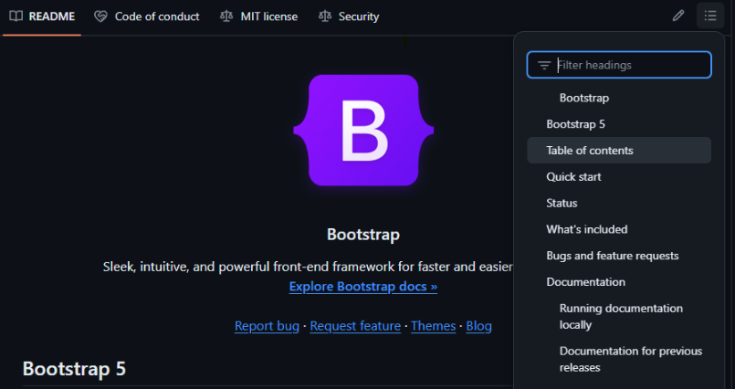

:::::::::::::::::::::::::::::::::::::: questions 

- What is a README file?
- How do I write a README?
- What are the contents of a good README file?

::::::::::::::::::::::::::::::::::::::::::::::::

::::::::::::::::::::::::::::::::::::: objectives

- Explain why and how to write a README file
- Learn how to structure a README file into sections
- Understand the important components of a good README

::::::::::::::::::::::::::::::::::::::::::::::::

## Introduction

A README file is the first thing a user sees when they find your software. It should give them an approachable overview of the package, define what’s possible to achieve with this code, and get them started on the right track to use the software effectively for their research.

A README contains a brief introduction to the code and shows them how to get started using it. For larger packages, the README forms a concise beginner guide and might link to a more detailed user guide that is located elsewhere.

The **audience** for a README file is the end user. It's important to consider _the person_ will read your documentation, and to see things from their point of view. It may be someone who is unfamiliar with certain technical terms, or a researcher will less experience of advanced computing. A good approach is to imagine writing a manual for a new user who has never seen this software before.

## How to write a README

To start writing a README file, the simplest way is to just create an empty text file called `README.txt` and start writing. This file should be located in the directory (or folder) that contains your software project. 

Most people prefer to use a file format that allows you to create headers to organise the content into sections or chapters, which is much clearer for the reader. In this case, a Markdown document may be used. Markdown is a simple mark-up language that allows you to format your text using symbols to represent headers, bold text, bullet lists, etc. that are displayed to the user in an appealing way.

An example README file in Markdown format is shown below, in a file called `README.md` where .md is the file extension for Markdown files.

```md
# My research software

This software is designed to...

# Installation

To install this software...

# Usage

To use this package...
```

The “#” symbol means that line will be converted into a header and displayed to the reader in a large, bold font.

If your code is published on GitHub, the home page of your code repository will display the README.md file, including a navigation menu that is automatically created to easily select the section of the document to view.

{alt="A screenshot of a GitHub repository with a drop-down navigation menu on the readme text box."}

The essentials contents of a README file are:

- The name of the software. This seems trivial, but a clear title and description of a piece of software will be essential for others to identify your software and differentiate it from others.
- A brief introduction to your code, including links to relevant websites or contact details for the maintainers. - It should be clear who the target audience is for the software package.
- Installation instructions or a link to further information published elsewhere.
- Usage instructions, ideally including a “quick start” guide with a few simple examples to get people up and running with your software package.

It can be useful to signpost to other, related useful software tools by providing links and explaining how other software is related or different to this project when it comes to addressing these kinds of research problems.

For research code, it’s often important to explain the context in which the software was written and the theory behind it. For example, many researchers write analysis packages or workflows that are based on previously-published research, statistical methods, or theoretical models for which citations can be provided. By including references to research papers we better help the users to understand the methods that are implemented by our software, which enables its users to properly cite their sources and increases the users’ confidence that you have applied those methods correctly.

### Installation instructions

Provide instructions for installing your research software. These steps should be laid out in simple, clear language and organised in a step-by-step manner.

For most research code, the user will need to install the programming language onto their computer, such as R or Python, so it’s useful to link to the download pages and provide a link to the package manager tools that are commonly used in those ecosystems. This might also include listing any prerequisites such as hardware or software that must be installed first, such as device drivers. 

Consider how the installation method might differ for users of other common operating systems, such as Windows, Linux, and Mac OS.

### User guide

All software should include some short guidance on how to use it and what the main options and features are. This might be a “quick start” guide with simple examples of common use-cases, or a walkthrough that uses a sample data set. Explain how the software can be configured or customised, including examples of commonly-used options. If the software integrates with other tools or uses specific file formats for its input and output, it’s useful to explain this here too. It’s a good idea to include links to further documentation if available.

Many users will benefit from a frequently asked questions (FAQ) or troubleshooting notes, which describes common error messages, explains why they occur, and the steps to resolve them.

The writing style should be concise, jargon-free, clear, and pitched at the appropriate level to the intended target audience. All technical terms and acronyms should be explained. However, don’t reinvent the wheel by defining all the terms used, instead link to a reliable external source or journal article.

Diagrams can be particularly useful to explain complex concepts and workflows. Screenshots may also provide a visual demonstration of how the software will work.

:::::: keypoints
 - TODO
::::::
